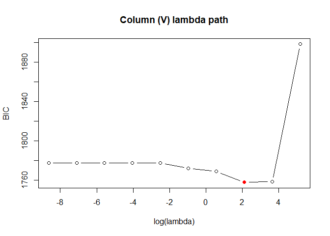

<!-- README.md is generated from README.Rmd. Please edit that file -->

# matSPACE

<!-- badges: start -->

[](https://github.com/kimhyew1/matSPACE/actions/workflows/R-CMD-check.yaml)
<!-- badges: end -->

This is a README file of the R package *matSPACE*. Our package fits
sparse partial correlation networks for matrix-variate data,
i.e. observations that are themselves p x q matrices rather than a
single vector of q measurements. We extend the SPACE (Sparse PArtial
Correlation Estimation) joint estimation framework to a
Kronecker-product precision structure, `Omega = V %x% U`, where `V` (q x
q) is the column-wise precision matrix and `U` (p x p) is the row-wise
precision matrix. All partial correlations are estimated jointly via an
L1-penalized (lasso) shooting algorithm, which preserves symmetry of the
estimated network and avoids the tuning-parameter selection difficulties
of separate node-wise regressions.

## Installation of the package

To install our package, you may simply execute the following codes:

``` r
install.packages("matSPACE")

# development version
# install.packages("pak")
pak::pak("kimhyew1/matSPACE")
```

## A basic example of using the package

We give a toy example to apply the main function `matSPACE`, which
estimates the Kronecker-structured row/column precision matrices `U` and
`V`.

### Generate data

We first generate simulated matrix-variate data. Columns 1-2 and columns
3-4 are correlated by construction, so there is real sparse structure
for `matSPACE` to recover (pure noise data has no structure to penalize
away, so the BIC-optimal fit is always the fully sparse one).

``` r
set.seed(1)
p = 5
q = 4
n = 20

library(matSPACE)
data = replicate(n, {
  mat = matrix(rnorm(p * q), p, q)
  mat[, 2] = mat[, 2] + 0.8 * mat[, 1]
  mat[, 4] = mat[, 4] + 0.8 * mat[, 3]
  mat
}, simplify = FALSE)
```

### Model fitting

Applying `matSPACE` to the simulated data, a lasso penalty path is
searched for `V` and `U` separately, and the BIC-minimizing fit is
returned for each.

``` r
fit = matSPACE(data, K = 10)
fit$V   # q x q column-wise precision matrix
#>             [,1]        [,2]        [,3]        [,4]
#> [1,]  1.00000000 -0.48986779  0.00000000 -0.09720007
#> [2,] -0.48986779  0.67543509 -0.05648484  0.00000000
#> [3,]  0.00000000 -0.05648484  1.03329539 -0.48039780
#> [4,] -0.09720007  0.00000000 -0.48039780  0.82809375
fit$U   # p x p row-wise precision matrix
#>            [,1]       [,2]        [,3]      [,4]        [,5]
#> [1,]  1.2461467 0.19063125 -0.30984454 0.0000000 -0.16769017
#> [2,]  0.1906313 1.52167139  0.00000000 0.1972048  0.07992512
#> [3,] -0.3098445 0.00000000  1.78285206 0.0000000 -0.09210015
#> [4,]  0.0000000 0.19720479  0.00000000 1.3713710  0.12289066
#> [5,] -0.1676902 0.07992512 -0.09210015 0.1228907  1.56699009
```

### Visualization of the lambda path

The full lambda path behind this selection is attached as a `"path"`
attribute, which lets us plot BIC against lambda without refitting.

``` r
path = attr(fit, "path")
plot(log(path$V$lambda), path$V$bic, type = "b",
     xlab = "log(lambda)", ylab = "BIC", main = "Column (V) lambda path")
i_min = which.min(path$V$bic)
points(log(path$V$lambda[i_min]), path$V$bic[i_min], col = "red", pch = 19)
```

<!-- -->

### Fitting with a single lasso penalty

If you already know the penalty you want, `space` fits a single lasso
penalty directly, without searching a path.

``` r
fit_single = space(data, lam = 0.5)
fit_single$ParCor
#>           [,1]       [,2]       [,3]       [,4]
#> [1,] 1.0000000 0.62797406 0.00000000 0.13888124
#> [2,] 0.6279741 1.00000000 0.09220064 0.06565944
#> [3,] 0.0000000 0.09220064 1.00000000 0.55404153
#> [4,] 0.1388812 0.06565944 0.55404153 1.00000000
```

## Issues

We are happy to troubleshoot any issue with the package;

- please contact to the maintainer by <kimhw4126@gmail.com>, or
- please open an issue in the github repository.
